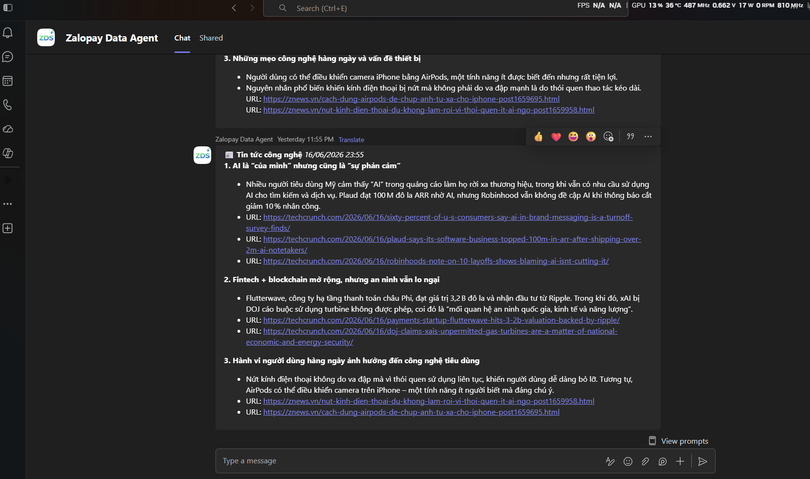

# Zalopay Data Agent

> Một **Chat Agent hỗ trợ phân tích số liệu (Data Analysis) & viết báo cáo tự động** ngay trong Microsoft Teams — biến folder OneDrive (M365) thành **"DATABASE"**, mỗi file Excel là một **"TABLE"**, và chỉ cần **ngôn ngữ tự nhiên** để ra insight rồi gửi báo cáo qua Teams/Outlook.
>
> **Ba năng lực nổi bật:**
>
> - 🔗 **Integration** — kết nối *trực tiếp* tới file Excel trên **OneDrive / SharePoint** (đọc qua Microsoft, không cần tải file về), biến dữ liệu trên cloud thành nguồn có thể truy vấn bằng câu hỏi.
> - 📊 **Statistical Analysis** — không chỉ thống kê mô tả, agent dùng **kiểm định thống kê** (A/B test với t-test / chi-square, khoảng tin cậy 95%, hiệu chỉnh Bonferroni) để đánh giá kết quả có **ý nghĩa về mặt thống kê** hay không — kết luận dựa trên bằng chứng, không phải cảm tính.
> - ⏰ **Automation** — **đặt lịch gửi báo cáo tự động theo lịch tùy ý** qua **Teams hoặc Outlook**, chỉ cần nói bằng ngôn ngữ tự nhiên — ví dụ: *"cứ 10 phút gửi 3 bài báo về AI hot nhất qua Teams"*. Agent chạy đều đặn, không cần thao tác lại.
>
> Dành cho **mọi người**, đặc biệt là khối **non-tech** (PO / Operations / Legal / Sale / Marketing) — những người không quen dùng database/server.

`[ English version ]`

> A **Chat Agent for data analysis & automated reporting**, right inside Microsoft Teams — it turns your personal OneDrive folder into a **"DATABASE"**, each Excel file into a **"TABLE"**, and lets you get insights and send reports over Teams/Outlook using only **natural language**.
>
> **Three standout capabilities:**
>
> - 🔗 **Integration** — connects *directly* to Excel files on **OneDrive / SharePoint** (read through Microsoft, no download needed), turning cloud data into a source you can query with plain questions.
> - 📊 **Statistical Analysis** — beyond descriptive stats, the agent runs **statistical tests** (A/B testing with t-test / chi-square, 95% confidence intervals, Bonferroni correction) to judge whether results are **statistically significant** — conclusions backed by evidence, not gut feeling.
> - ⏰ **Automation** — **schedule automated reports on any cadence** to **Teams or Outlook**, just by asking in natural language — e.g. *"every 10 minutes, send the 3 hottest AI articles to Teams"*. The agent runs reliably, with no repeat manual work.
>
> Built for **everyone**, especially **non-technical** teams (PO / Operations / Legal / Sales / Marketing) — people who don't usually work with databases or servers.

---

## Demo

[](https://vngms-my.sharepoint.com/:v:/r/personal/hoangnx3_vng_com_vn/Documents/HACKATHON_DATA_WAREHOUSE/DEMO/hoangnx3_data_agent_02.mp4?csf=1&web=1&nav=eyJyZWZlcnJhbEluZm8iOnsicmVmZXJyYWxBcHAiOiJPbmVEcml2ZUZvckJ1c2luZXNzIiwicmVmZXJyYWxBcHBQbGF0Zm9ybSI6IldlYiIsInJlZmVycmFsTW9kZSI6InZpZXciLCJyZWZlcnJhbFZpZXciOiJNeUZpbGVzTGlua0NvcHkifX0&e=akOE2U)

---

## Problem

Phân tích dữ liệu và viết báo cáo định kỳ là việc **ai cũng phải làm**, nhưng công cụ kết nối với **server/database** thì không dễ dàng sử dụng cho **nhóm non-tech**:

1. **Khối non-tech bị khó ở khâu công cụ kĩ thuật.** PO, Operations, Legal, Sale, Marketing có dữ liệu (nằm rải rác trong các file Excel trên OneDrive) nhưng không biết SQL, không có quyền truy cập database/server.
2. **Báo cáo định kỳ tốn thời gian và dễ trễ.** Mỗi sáng/mỗi tuần lại mở file, lọc, tính, copy vào email/Teams gửi cho sếp và team — thủ công, lặp đi lặp lại, và hay quên.
3. **Quyết định thiếu căn cứ thống kê.** "Tính năng mới có thật sự tốt hơn không?", "Kênh marketing nào hiệu quả?" — thường được trả lời bằng cảm tính thay vì kiểm định thống kê.

Kết quả: dữ liệu thì có mà insight thì không, báo cáo trễ, và quyết định dựa trên cảm tính.

`[ English version ]`

Analyzing data and writing recurring reports is something **everyone** has to do, but the tools that connect to **servers/databases** are not easy for **non-technical** teams to use:

1. **Non-technical teams are blocked at the tooling step.** PO, Operations, Legal, Sales, and Marketing have data (scattered across Excel files on OneDrive) but don't know SQL, lack access to databases/servers, and can't build dashboards.
2. **Recurring reports are time-consuming and easily late.** Every morning/week you reopen files, filter, compute, and copy results into email/Teams for your boss and team — manual, repetitive, and easy to forget.
3. **Decisions lack statistical grounding.** "Is the new feature actually better?", "Which marketing channel works?" — usually answered by gut feeling instead of statistical testing.

The result: plenty of data but no insight, late reports, and decisions driven by gut feeling.

---

## Users

| Who | How they use it |
|-----|----------------|
| **Product Owner** | Attach the experiment-results Excel file in Teams → the agent runs a **statistical A/B test** (p-value, confidence interval, significance) and concludes **RELEASE / DON'T RELEASE** with guardrails. |
| **Operations** | Send a ticket/request file → the agent reads it, tracks team performance, flags who is **overdue / overloaded**, and suggests resource allocation. |
| **Marketing** | Analyze **campaign** performance and compare **media channels** — all from existing Excel files. |
| **Sale / Seller** | Out in the field, enter numbers into an **online Excel file (OneDrive)** used as a data-collection tool → the agent **connects directly**, writes, and **sends a daily sales report automatically**. |
| **Everyone (non-tech)** | Ask data questions in natural language ("revenue for the last 3 days?", "chart by province"), schedule reports, read tech news — no SQL or server setup needed. |

---

## Solution

### Ý tưởng cốt lõi — OneDrive là "DATABASE", Excel là "TABLE"

```text
   📁 OneDrive folder   ≈   DATABASE
   📄 file .xlsx        ≈   TABLE
   💬 câu hỏi tiếng Việt ≈   QUERY
```

Sự liên kết **MS Teams ⇄ OneDrive (Excel) ⇄ Outlook** cho phép người dùng phân tích dữ liệu ra insight và gửi báo cáo tự động — **chỉ bằng ngôn ngữ tự nhiên trong cửa sổ chat Teams**. Không export CSV, không cài đặt, không rời khỏi Teams.

### Các use case đặc biệt

- **🧪 [Agent for PO] — A/B Testing.** Đánh giá tính năng mới bằng **kiểm định thống kê** (Welch t-test cho continuous, chi-square cho binary, hiệu chỉnh **Bonferroni** khi nhiều metric, **khoảng tin cậy 95%**, Cohen's d / Cramér's V). Tự phát hiện **guardrail violation** và đưa khuyến nghị **RELEASE / rollout có kiểm soát / KHÔNG RELEASE**, kèm breakdown theo platform.
- **🛠️ [Agent for Operations] — Theo dõi đội ngũ.** Đọc file Excel request/ticket, theo dõi hiệu suất team, phát hiện member nào **overdue / gặp khó khăn**, phân tích và đánh giá nguồn lực.
- **📣 [Agent for Marketing] — Hiệu quả campaign.** Phân tích các chiến dịch, đánh giá **kênh truyền thông hiệu quả** từ dữ liệu chiến dịch.
- **🧳 [Agent for Seller] — Báo cáo doanh số thực địa.** Seller đi thị trường nhập số vào file Excel online; agent **connect trực tiếp** vào file đó, viết báo cáo tình hình kinh doanh và **gửi tự động mỗi ngày**.
- **📰 [Agent for News/Research] — Cập nhật AI.** Đọc **TechCrunch** (+ Hacker News, VnExpress Tech, hoặc nguồn RSS tùy chỉnh) để cập nhật tin AI mới nhất. Ví dụ: *cứ 10 phút gửi 3 bài hot nhất qua Teams* — chỉ cần nói "cứ 10 phút gửi cho tôi 3 tin công nghệ".

### Giao diện

Agent hoạt động trực tiếp trong **Microsoft Teams**. Dưới đây là ví dụ bản tin công nghệ được agent tổng hợp và **tự động gửi vào Teams theo lịch**:



### Năng lực chính

Agent là một **LangChain ReAct orchestrator** đọc ý định người dùng và tự chọn trong bộ **24 công cụ** để thực thi:

### 1. Phân tích Excel theo thời gian thực

Đính kèm file `.xlsx` vào Teams (hoặc dán link OneDrive/SharePoint). Agent đọc trực tiếp qua **Microsoft Graph Workbook API** (không cần tải file về). Câu hỏi follow-up được trả lời bằng **pandas dataframe agent** — chỉ kết quả đã tính được đưa vào LLM, nên file lớn không tràn context.

### 2. Trực quan hóa

Sinh biểu đồ PNG bằng matplotlib/seaborn — **9 loại**: bar, line, area, pie, donut, scatter, histogram, heatmap, và **funnel** (phễu chuyển đổi tự tính % drop-off). Gửi vào Teams dưới dạng Adaptive Card.

### 3. Báo cáo tự động định kỳ

Đặt lịch bằng ngôn ngữ tự nhiên ("mỗi sáng 8h", "cứ 10 phút", "hàng ngày"). **APScheduler** tự đọc lại file OneDrive mới nhất, phân tích và **gửi báo cáo qua Teams hoặc Outlook**. Job được persist nên sống sót qua restart.

### 4. Hạn chế

Tính năng **đính kèm file trực tiếp** hiện chỉ hoạt động tốt trên **máy tính (laptop/PC) và bản Web** của Microsoft Teams. Trên **thiết bị di động (mobile)**, việc đọc file đính kèm hiện **chưa ổn định** — đây là **hạn chế từ phía ứng dụng Microsoft Teams**, không phải của agent.

> 💡 **Khắc phục trên mobile:** thay vì đính kèm trực tiếp, hãy gửi **link OneDrive/SharePoint** trỏ tới file — agent đọc file qua Microsoft Graph và phân tích bình thường.

### Architecture

```text
                     Microsoft Teams
                           │  (Bot Framework Activity — text + file attachments)
                           ▼
        ┌──────────────────────────────────────────┐
        │  FastAPI  (app/main.py)                    │
        │  POST /webhook/teams                       │
        │   • trả 200 OK NGAY (fire-and-forget)      │
        │   • bật typing indicator, xử lý async      │
        └───────────────────┬────────────────────────┘
                            │ asyncio.create_task
                            ▼
        ┌──────────────────────────────────────────┐
        │  Data Agent  (app/agent.py)                │
        │  LangChain ReAct • SYSTEM_PROMPT (tiếng Việt)
        │  checkpointer = AgentBase Memory • auto-compact
        └───────────────────┬────────────────────────┘
                            │ tool calls (24 tools — app/tools.py)
        ┌───────────────────┼─────────────────────────────────┐
        ▼                   ▼                                  ▼
  📊 Excel/A-B/Chart   📰 News (RSS)              ⏰ Schedule (APScheduler)
  pandas · scipy ·     feedparser ·              job persist qua restart
  matplotlib           BeautifulSoup
        │                   │                                  │
        ▼                   ▼                                  ▼
  Microsoft Graph      TechCrunch / HN / RSS     gửi định kỳ →
  (OneDrive · Outlook · Workbook API)            Teams / Outlook
        │
        ▼
  send_teams_reply (app/teams.py — Bot Framework Connector API)

  ↑ Toàn bộ lời gọi LLM đi qua GreenNode MaaS (OpenAI-compatible).
  ↑ Memory & IAM credentials do AgentBase Runtime cung cấp.
```

**Điểm cốt lõi:** webhook trả `200 OK` ngay lập tức rồi xử lý bất đồng bộ (Teams timeout nhanh). Agent **chủ động** gửi reply ngược lại qua Bot Framework Connector API.

---

## How to Run

### Prerequisites

- Python 3.9+
- GreenNode MaaS API key (LLM) — lấy qua `/agentbase-llm`
- Azure Bot registration (`TEAMS_APP_ID` / `TEAMS_CLIENT_SECRET` / `TEAMS_TENANT_ID`)

### 1. Clone and install

```bash
git clone <repo-url>
cd greennode-data-agent
python3 -m venv .venv
source .venv/bin/activate
pip install -r requirements.txt
```

### 2. Configure environment

```bash
cp .env.example .env
```

Điền các biến chính trong `.env` (file `.env` **không bao giờ commit**):

```env
# LLM — GreenNode MaaS (OpenAI-compatible)
LLM_API_KEY=your-maas-api-key
LLM_BASE_URL=https://maas-llm-aiplatform-hcm.api.vngcloud.vn/v1
LLM_MODEL=your-model

# Microsoft Teams Bot
TEAMS_APP_ID=...
TEAMS_CLIENT_SECRET=...
TEAMS_TENANT_ID=...

# Public URL của bot — cần cho OAuth callback + ảnh chart
BOT_BASE_URL=https://your-public-host

# (tuỳ chọn) Memory, PostgreSQL, nguồn RSS
AGENTBASE_MEMORY_ID=
DATABASE_URL=
NEWS_RSS_FEEDS=
```

> Đầy đủ danh sách biến môi trường: xem [app/README.md](app/README.md#biến-môi-trường).

### 3. Start the server

```bash
# Local dùng port 8000; AgentBase Runtime dùng 8080
uvicorn app.main:app --reload --host 0.0.0.0 --port 8000
```

Test nhanh không cần Teams (endpoint đồng bộ):

```bash
curl -X POST http://localhost:8000/invocations \
  -H "Content-Type: application/json" \
  -d '{"message":"Cho tôi 3 tin công nghệ mới nhất"}'
```

### 4. Dùng agent trong Teams

Bắt đầu chat với agent ngay trong Microsoft Teams bằng ngôn ngữ tự nhiên.

**Luồng sử dụng:**

1. Hỏi "bạn là ai?" để xem agent giới thiệu năng lực
2. Đính kèm file Excel + hỏi "phân tích giúp tôi" → agent đọc & tóm tắt insight
3. Hỏi follow-up ("doanh thu 3 ngày gần nhất?", "vẽ funnel") → agent tính & vẽ chart
4. Đính kèm file A/B test + "đánh giá có nên release không" → báo cáo thống kê
5. "Cứ 10 phút gửi tôi 3 tin công nghệ" / "Mỗi sáng 8h gửi báo cáo doanh số file này qua email" → đặt lịch tự động
6. Lần đầu dùng OneDrive/Email → agent trả link đăng nhập Microsoft (OAuth)

### Optional: Docker

```bash
# Runtime chạy amd64 — build đúng platform
docker build --platform linux/amd64 -t data-agent:local .
docker run --rm --env-file .env -p 8080:8080 data-agent:local

# hoặc docker-compose (kèm volume ./data để persist job)
docker compose up --build
```

> Container chạy non-root, expose **port 8080**, healthcheck `GET /health` — đây là contract của AgentBase Runtime.

---

## Deploy to AgentBase

Chạy local là bước đầu. Để agent hoạt động **production** với endpoint ổn định, identity riêng, memory, và monitoring tích hợp → deploy lên **GreenNode AgentBase**.

### Dùng AgentBase Skills

Repo này đi kèm [**greennode-agentbase-skills**](https://github.com/vngcloud/greennode-agentbase-skills) trong [.claude/skills/](.claude/skills/) — bộ skill cho Claude Code (và các client SKILL.md khác) hỗ trợ toàn bộ lifecycle: scaffold → config → deploy → monitor → teardown.

**Thêm skill vào project:**

```bash
mkdir -p ~/.claude/skills
cp -r .claude/skills/* ~/.claude/skills/
```

**Các lệnh chính:**

```
/agentbase-wizard      # Scaffold + dẫn dắt toàn bộ lifecycle
/agentbase-llm         # Lấy API key + chọn model LLM trên GreenNode MaaS
/agentbase-memory      # Tạo memory store (conversation + long-term)
/agentbase-identity    # Lưu credential outbound (Microsoft Graph, ...)
/agentbase-deploy      # Build image, push lên Container Registry, tạo/cập nhật runtime
/agentbase-monitor     # Logs, CPU/Memory, distributed traces
```

---

### Lợi ích khi chạy trên AgentBase

#### Endpoint ổn định — URL không đổi khi update version

Mỗi agent có một **DEFAULT endpoint** với URL cố định. Deploy version mới → URL vẫn giữ nguyên, client (Azure Bot messaging endpoint) không cần đổi config.

---

#### Version control tự động — rollback bất kỳ lúc nào

Mỗi lần deploy tạo ra một **snapshot version** tự động. Xem lịch sử, so sánh, hoặc rollback về version cũ chỉ bằng vài click.

---

#### Monitoring tích hợp — CPU, Memory, Logs, Tracing

AgentBase tích hợp sẵn **vMonitor Platform**: CPU/Memory theo thời gian thực, truy vết từng request qua Distributed Tracing — không cần setup thêm công cụ observability.

---

#### Memory — nhớ context giữa các lượt trong cùng phiên

AgentBase Memory lưu lịch sử hội thoại theo `thread_id = {user}:{conversation}`, cô lập theo từng user + cuộc trò chuyện. Agent nhớ file đã phân tích, lịch đã đặt, và sở thích của user — kèm cơ chế **auto-compact 2 pha** để không tràn context. Để trống `AGENTBASE_MEMORY_ID` → dùng in-process (reset khi restart); có giá trị → persist qua platform.

---

#### Agent Identity & outbound auth

Dùng `/agentbase-identity` để lưu credential gọi dịch vụ ngoài (Microsoft Graph cho OneDrive/Outlook). Trên Runtime, các biến `GREENNODE_*` được **inject tự động** — agent truy cập Memory service mà không cần đặt thủ công.

---

## What to Customize

### Đổi hành vi / persona của agent

System prompt nằm trong [app/agent.py](app/agent.py) (`SYSTEM_PROMPT`). Sửa để đổi danh tính, năng lực được quảng bá, hoặc quy tắc chọn tool.

### Đổi logic A/B test

Toàn bộ kiểm định thống kê ở [app/abtest.py](app/abtest.py): ngưỡng `alpha`, hiệu chỉnh Bonferroni, cách chọn primary metric, và **ngưỡng khuyến nghị RELEASE** (`_format_recommendation`).

### Thêm/đổi loại biểu đồ

Engine vẽ chart ở [app/charts.py](app/charts.py) — 9 loại hiện có (gồm funnel), thêm loại mới hoặc đổi palette tại đây.

### Đổi nguồn tin tức

Mặc định TechCrunch + Hacker News + VnExpress Tech (`DEFAULT_FEEDS` trong [app/news.py](app/news.py)). Override bằng biến `NEWS_RSS_FEEDS` trong `.env`, hoặc để user tự thêm nguồn qua tool `add_news_source`.

### Đổi model LLM

Trong `.env`, đặt `LLM_MODEL` thành bất kỳ model nào có trên GreenNode MaaS (xem catalog qua `/agentbase-llm`).

### Thêm công cụ mới

Tất cả tool đăng ký trong `TOOLS` ở cuối [app/tools.py](app/tools.py). Viết một LangChain tool mới và thêm vào danh sách — agent tự nhận biết qua system prompt.

### Đổi loại lịch tự động

Các loại job (tin tức, email, báo cáo Excel, watch OneDrive folder) định nghĩa trong [app/scheduler.py](app/scheduler.py); persistence ở [app/job_persist.py](app/job_persist.py).

---

## Project Structure

```text
zalopay_data_agent/
├── app/                      # Core agent (xem app/README.md cho chi tiết)
│   ├── main.py               # FastAPI: webhook, OAuth callback, chart serving, health
│   ├── agent.py              # Data Agent — LangChain ReAct, system prompt, auto-compact
│   ├── tools.py              # 24 LangChain tools (Excel · chart · A/B · news · schedule · email · OneDrive · auth)
│   ├── llm.py                # Factory ChatOpenAI từ biến môi trường (GreenNode MaaS)
│   ├── memory.py             # Checkpointer (MemorySaver / AgentBaseMemoryEvents) + remember/recall
│   ├── excel.py              # Parse Excel → DataFrame → markdown phân tích
│   ├── abtest.py             # A/B test thống kê (scipy: t-test, chi-square, Bonferroni, CI)
│   ├── charts.py             # Engine vẽ chart matplotlib/seaborn (9 loại, gồm funnel)
│   ├── onedrive.py           # Microsoft Graph: OAuth, delegated token, Workbook range, watch folder
│   ├── teams.py              # Bot Framework: gửi reply, token cache, typing, Adaptive Card, email
│   ├── news.py               # RSS feedparser + trích xuất nội dung bài báo
│   ├── scheduler.py          # APScheduler manager: các loại job + persistence
│   ├── job_persist.py        # Lưu/khôi phục job qua diskcache (sống sót qua restart)
│   └── pg_store.py           # PostgreSQL store (user, nguồn tin, Teams context)
│
├── .claude/skills/           # Bộ AgentBase Skills (deploy/monitor/teardown từ AI coding tool)
├── Dockerfile                # amd64, non-root, port 8080, healthcheck /health
├── docker-compose.yml        # Local run kèm volume ./data
├── requirements.txt          # Python dependencies
├── .env.example              # Configuration template
└── README.md                 # ← file này
```

---

## How GreenNode MaaS is Used

Toàn bộ lời gọi LLM đi qua **GreenNode MaaS** tại `https://maas-llm-aiplatform-hcm.api.vngcloud.vn/v1` qua API OpenAI-compatible:

```python
# app/llm.py
from langchain_openai import ChatOpenAI

llm = ChatOpenAI(
    base_url=os.getenv("LLM_BASE_URL"),   # GreenNode MaaS
    api_key=os.getenv("LLM_API_KEY"),
    model=os.getenv("LLM_MODEL"),
)
```

LLM (qua LangChain ReAct) đảm nhận:

1. **Hiểu ý định** người dùng từ tiếng Việt tự nhiên và **chọn tool** phù hợp trong 24 tools
2. **Diễn giải kết quả** phân tích (Excel, A/B test, tin tức) thành báo cáo dễ đọc
3. **Tóm tắt lịch sử hội thoại** (auto-compact) để duy trì memory dài mà không tràn context
4. **Pandas dataframe agent** sinh & chạy code pandas cho câu hỏi follow-up trên dữ liệu Excel

Phần phân tích số học (thống kê A/B, vẽ chart) chạy **deterministic** bằng scipy/pandas/matplotlib — LLM chỉ điều phối và diễn giải, đảm bảo con số luôn chính xác.

---

> **Tài liệu kỹ thuật chi tiết** (kiến trúc, từng tool, biến môi trường, debug/troubleshooting): xem [app/README.md](app/README.md).
